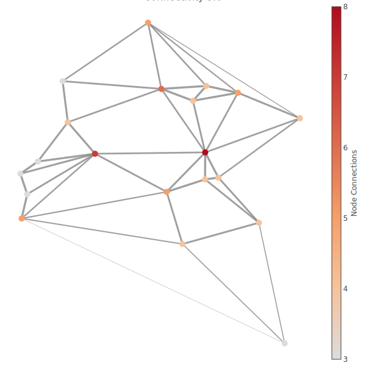

```@meta
EditURL = "../../../examples/axis.jl"
```

# Setup
Install dependencies

````julia
import Pkg
let
    pkgs = ["PlotlyLight", "ColorSchemes", "VisualizationBag", "SpatialGSP"]
    for pkg in pkgs
        if Base.find_package(pkg) === nothing
            Pkg.add(pkg)
        end
    end
end;
````

Load packages.

````julia
using LinearAlgebra

import PlotlyLight as PLY
import ColorSchemes

import VisualizationBag as VIZ
import SpatialGSP as GSP

import Random
Random.seed!(25);
````

Specify floating-point data type and dimension.

````julia
T = Float64
D = 2;
````

Scattered positions.

````julia
N = 20
X = collect( randn(T, D) for _ = 1:N );

#uncomment this if we want to see the graph generated from a grid instead of scattered positions.
#X0 = vec(collect( Iterators.product(-5:4,-3:6) ))
#X = collect( convert(Vector{T}, collect(x)) for x in X0)
#N = length(X);
````

# Axis search graph construction
`η` controls the creation of edges from `X`.
`w_lb` is the minimum edge weight. The other edges are weighted according to a square exponential kernel that attains `w_lb` for the shortest pair-wise distance in `X`.
Larger values of `η` means the generated graph is more like a nearest neighbors graph. A lower value means the generated graph is more like a grid graph.

````julia
η = convert(T, 3)
kernel_ref = GSP.SqExp(T)
config = GSP.AxisSearchConfig{T}(
    kernel_σ_multiplier = η,
    make_undirected = true,
    remove_null_nbs = true,
    w_lb = convert(T, 0.1)
);
````

Construct the graph: Nodes are the points in `X`.

````julia
G = GSP.create_axis_graph(config, X);
````

# Visualize

````julia
width = 600 # plot width.
height = 600; # plot height.
````

Create edges

````julia
edge_h = GSP.getedgecoord(G, X, 1) # horizontal
edge_v = GSP.getedgecoord(G, X, 2); # vertical
````

Create a PlotlyJS trace for nodes.

````julia
x_h = map(xx->xx[begin], X)
x_v = map(xx->xx[begin+1], X)
N_nbs = GSP.getNnbs(G)

nodes_trace = PLY.Config(
    name = "Node",
    x = x_v,
    y = x_h,
    mode = "markers",
    text = [
        "Node $n, Neighbors: $(N_nbs[n])"
        for n in eachindex(N_nbs)
    ],
    marker = PLY.Config(
        showscale = true,
        colorscale = ColorSchemes.viridis,
        color = N_nbs,
        size = 10,
        colorbar = PLY.Config(
            thickness = 15,
            title = "Node Connections",
            xanchor = "left",
            titleside = "right"
      ),
    ),
);
````

Create the PlotlyJS layout trace.

````julia
layout = PLY.Config(
    width = width,
    height = height,
    margin = PLY.Config( # rid of white spaces around the saved plot.
        l = 1, # measured in pixels. l for left, etc.
        r = 1,
        t = 1,
        b = 1,
    ),
    hovermode = "closest",
    title = "Connectivity $η",
    titlefont = PLY.Config(
        size = 16,
    ),
    showlegend = false,
    showarrow = false,
    xaxis = PLY.Config(
        showgrid = false,
        zeroline = false,
        showticklabels = false,
    ),
    yaxis = PLY.Config(
        showgrid = false,
        zeroline = false,
        showticklabels = false,
    ),
);
````

Create the trace for edges and their midpoints. The implementation is in the `VisualizationBag` package.

````julia
eds, mid_pts_trace = VIZ.get2Dedgetraces_variablewidth(
    PLY, G.edges.srcs, G.edges.dests, G.edges.ws, X,
);
````

````julia
v = vcat(eds...)
push!(v, mid_pts_trace)
push!(v, nodes_trace)
ph = PLY.Plot(v, layout);
````

# Save plot

````julia
#Uncomment to save as HTML.
#PLY.save(ph, "output/axis_graph_$(η).html")

import PlotlyKaleido
PlotlyKaleido.start()
````

Pause the current Julia session until we save the image.

````julia
t = @task begin
    (;data, layout, config) = ph
    PlotlyKaleido.savefig(
        ph,
        "axis_lit.svg";
        width = width,
        height = height,
    )
end
schedule(t)
wait(t);
````



The node colors correspond to the number of connections, and the thickness of an edge is proportional to the edge weight.

---

*This page was generated using [Literate.jl](https://github.com/fredrikekre/Literate.jl).*

