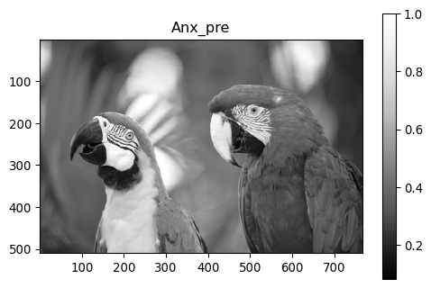
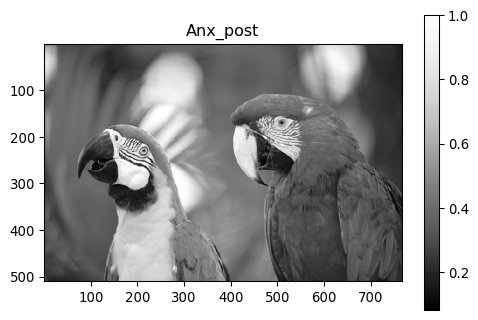
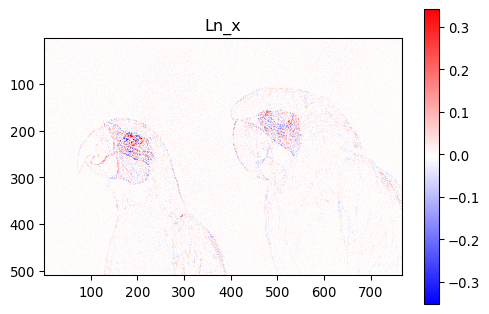
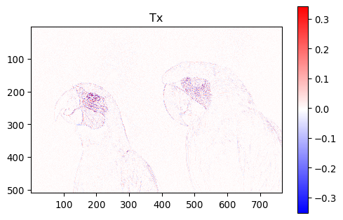
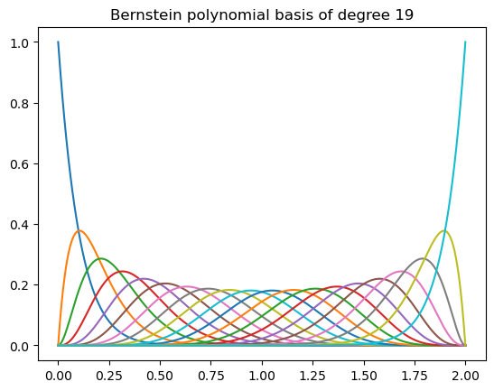
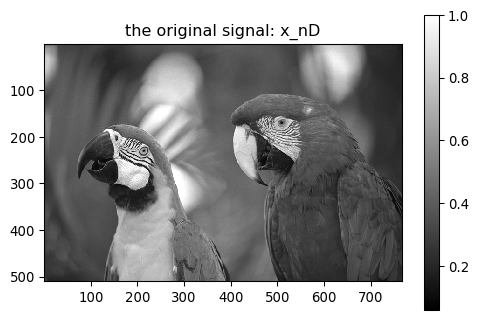
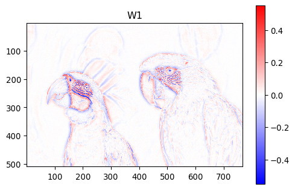
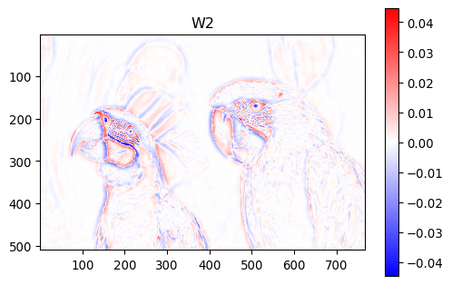

```@meta
EditURL = "../../../examples/bernstein_filtering.jl"
```

# Setup
Install dependencies

````julia
import Pkg
let
    pkgs = ["PythonPlot", "VisualizationBag", "Images", "SpatialGSP"]
    for pkg in pkgs
        if Base.find_package(pkg) === nothing
            Pkg.add(pkg)
        end
    end
end;
````

Load packages.

````julia
using LinearAlgebra
using SparseArrays

import PythonPlot
const PLT = PythonPlot

import VisualizationBag as VIZ
import Images

import SpatialGSP as GSP
const Graphs = GSP.Graphs
const NN = GSP.NN
const Distances = GSP.Distances

import Random
Random.seed!(25);

#Helper routines
include("helpers/viz/misc.jl")
include("helpers/image.jl");

#Reset plot figures.
fig_num = 1
PLT.close("all");

#Specify floating-point data type and dimension.
T = Float64
D = 2;
````

````
    CondaPkg Found dependencies: /home/roy/.julia/packages/PythonCall/F4kmJ/CondaPkg.toml
    CondaPkg Found dependencies: /home/roy/.julia/packages/PythonPlot/KcWMF/CondaPkg.toml
    CondaPkg Dependencies already up to date

````

Load image data

````julia
img = loadkodakimage(T, "./data/kodim23.png"; discard_pixels = 1)
x_nD, x_ranges = image2samples(img)
sz_x = size(x_nD);
````

Treat the grid-based data `x_nD` as a signal on a grid graph. Get the 1-hop neighbors:

````julia
nbs = GSP.getgridnbs(size(x_nD))
x = vec(x_nD);
````

## visualize graph signal.

````julia
fig_num = VIZ.plotmeshgrid2D(
    PLT,
    x_ranges,
    x_nD,
    [],
    "x",
    fig_num,
    "original image, x";
    cmap = "Greys_r",
    matrix_mode = true
)
PLT.gcf()
````


# Graph Laplacian

````julia
G = GSP.UnitGrid(nbs) # generate grid graph.
graph = GSP.getgraph(G);
````

Basic one-hop operators.

````julia
A = GSP.create_adjacency(G) # adjacency matrix
deg = GSP.create_degree(G) # degree matrix.
deg_inv = GSP.create_invdegree(T, G)
L = GSP.create_laplacian(G); # combinatorial Laplacian matrix.
````

Normalized Laplacian operators..

````julia
Ln = GSP.create_snlaplacian(T, G) # symmetric normalized Laplacian matrix.
TL = GSP.create_rwlaplacian(T, G); # random-walk Laplacian matrix.
````

# Visualize the action of each operator

````julia
Ax = A*x
Anx_pre = deg_inv*A*x
Anx_post = A*deg_inv*x
Lx = L*x
Tx = TL*x
Ln_x = Ln*x;
````

Adjacency.

````julia
fig_num = VIZ.plotmeshgrid2D(
    PLT,
    x_ranges,
    reshape(Ax, sz_x),
    [],
    "x",
    fig_num,
    "Ax";
    cmap = "Greys_r",
    matrix_mode = true,
)
PLT.gcf()
````


Normalize inflow.

````julia
fig_num = VIZ.plotmeshgrid2D(
    PLT,
    x_ranges,
    reshape(Anx_pre, sz_x),
    [],
    "x",
    fig_num,
    "Anx_pre";
    cmap = "Greys_r",
    matrix_mode = true,
)
PLT.gcf()
````


Normalize outflow.

````julia
fig_num = VIZ.plotmeshgrid2D(
    PLT,
    x_ranges,
    reshape(Anx_post, sz_x),
    [],
    "x",
    fig_num,
    "Anx_post";
    cmap = "Greys_r",
    matrix_mode = true,
)
PLT.gcf()
````


Combinatorial Laplacian.

````julia
fig_num = VIZ.plotmeshgrid2D(
    PLT,
    x_ranges,
    reshape(Lx, sz_x),
    [],
    "x",
    fig_num,
    "Lx";
    cmap = "bwr",
    matrix_mode = true,
)
PLT.gcf()
````


Symmetric normalized Laplacian.

````julia
fig_num = VIZ.plotmeshgrid2D(
    PLT,
    x_ranges,
    reshape(Ln_x, sz_x),
    [],
    "x",
    fig_num,
    "Ln_x";
    cmap = "bwr",
    matrix_mode = true,
)
PLT.gcf()
````


Random-walk Laplacian.

````julia
fig_num = VIZ.plotmeshgrid2D(
    PLT,
    x_ranges,
    reshape(Tx, sz_x),
    [],
    "x",
    fig_num,
    "Tx";
    cmap = "bwr",
    matrix_mode = true,
)
PLT.gcf()
````


# Bernstein filtering

tuning parameters.

````julia
discount_factor = 0.5
N_bands = 20
Bernstein_degree = N_bands -1;
````

computewarpsamplesiterated() operates under the assumption that the eigenvalues of `L_map` is in [0,λ_max].

````julia
λ_max = convert(T, 2)
L_map = TL; # set to random-walk Laplacian.
````

Visualize the Berinstein polynomial basis.

````julia
fig_num = visualizebernsteinbasis(
    λ_max, Bernstein_degree, fig_num;
    show_legend = false,
)
PLT.gcf()
````


Get a set of fixed-spectrum warp samples.

````julia
Ws, Rs, λs = GSP.computewarpsamplesiterated(
    x,
    L_map,
    GSP.BernsteinFBConfig(N_bands = N_bands, λ_max = λ_max);
    iterate_threshold = convert(T, 10),
    discount_factor = discount_factor,
    max_iters = 10,
    verbose = false,
);
````

visualize the original image.

````julia
fig_num = VIZ.plotmeshgrid2D(
    PLT,
    x_ranges,
    reshape(x_nD, sz_x),
    [],
    "x",
    fig_num,
    "the original signal: x_nD";
    cmap = "gray",
    matrix_mode = true,
)
PLT.gcf()
````


Visualize the sum

````julia
W1 = sum(Ws)
fig_num = VIZ.plotmeshgrid2D(
    PLT,
    x_ranges,
    reshape(W1, sz_x),
    [],
    "x",
    fig_num,
    "W1";
    cmap = "bwr",
    matrix_mode = true,
    symmetric_color_range = true,
)
PLT.gcf()
````


Visualize the normalized sum. Less noisy, thicker contours.

````julia
W2 = GSP.sumnormalized(Ws)
fig_num = VIZ.plotmeshgrid2D(
    PLT,
    x_ranges,
    reshape(W2, sz_x),
    [],
    "x",
    fig_num,
    "W2";
    cmap = "bwr",
    matrix_mode = true,
    symmetric_color_range = true,
)
PLT.gcf()
````


# Convenience routine

````julia
W2, G = GSP.get_grid_warp_samples(
    x_nD,
    GSP.WarpConfig{T}(),
)
fig_num = VIZ.plotmeshgrid2D(
    PLT,
    x_ranges,
    reshape(W2, sz_x),
    [],
    "x",
    fig_num,
    "W2";
    cmap = "bwr",
    matrix_mode = true,
    symmetric_color_range = true,
)
PLT.gcf()

nothing;
````

---

*This page was generated using [Literate.jl](https://github.com/fredrikekre/Literate.jl).*

